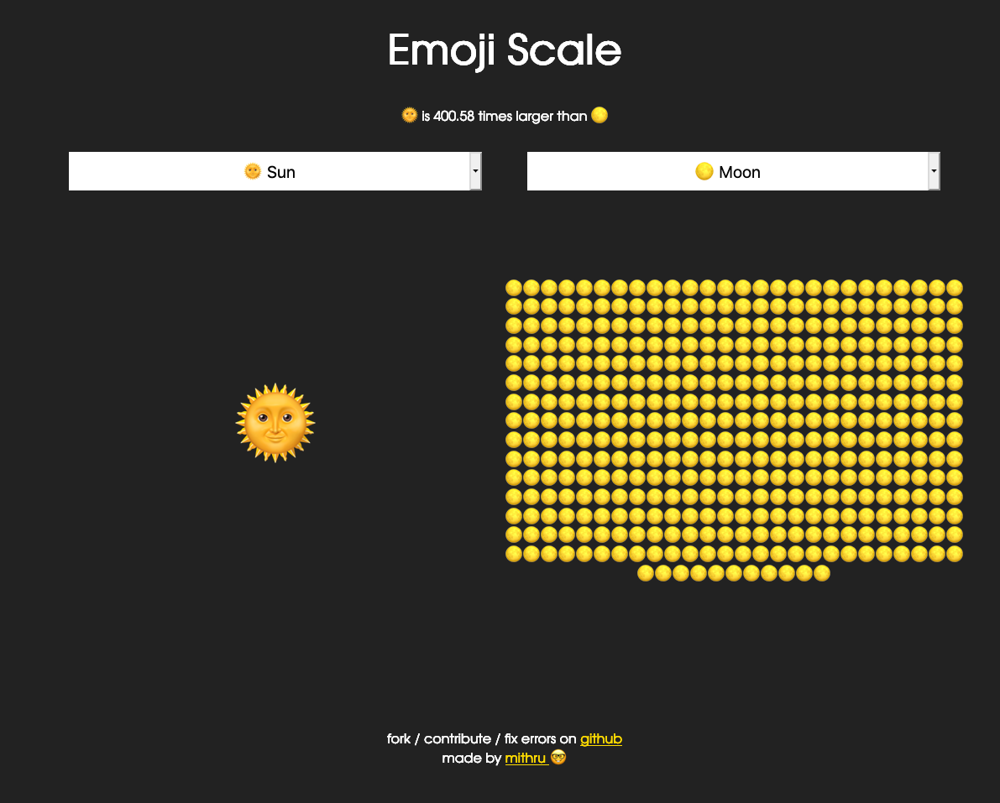

# EmojiScale
Compare the real size of the objects that emojis represent

This is still a work in progress. Data is not verified and very likely wrong at the moment. I've filed an issue to address this. I'll get to it when I can.

